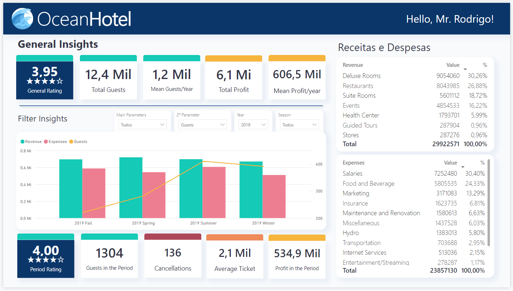

# OceanHotel Financial Dashboard
## Getting This

## From this

## Objective
The OceanHotel Financial Dashboard is designed to provide comprehensive financial insights for the OceanHotel resort, a luxury hotel located in São Miguel do Gostoso, Rio Grande do Norte. This dashboard has been developed in response to concerns from Mr. Rodrigo, the hotel manager, regarding the potential impact of the current economic climate on the hotel's profit margins. Given the rising costs of supplies and the stable prices of room rates, there is a need for an effective tool to manage and analyze the hotel's financial performance.

## Project Description
This project involves the creation of a financial management dashboard using Power BI, based on the provided dataset of revenues and expenses from beOcean. The dashboard aims to:

 - Monitor Financial Performance: Track and visualize key financial metrics, including revenues, expenses, and profit margins over time.
 - Identify Trends: Analyze trends in costs and revenues to help identify areas for potential cost savings or revenue growth.
 - Make Data-Driven Decisions: Provide actionable insights to support strategic decision-making for maintaining and improving the hotel's financial health.

# How to Use
 - Open the Power BI file: Download and open the .pbix file in Power BI Desktop.
 - Explore the Dashboard: Navigate through the different sections of the dashboard to view various financial metrics and insights.
 - Analyze the Data: Use the interactive features of Power BI to drill down into specific data points and analyze trends.

# Conclusion
The OceanHotel Financial Dashboard provides a powerful tool for the management team to monitor and optimize the hotel's financial performance. By leveraging this dashboard, Mr. Rodrigo and his team can make informed decisions to navigate the economic challenges and sustain the profitability of the OceanHotel resort.